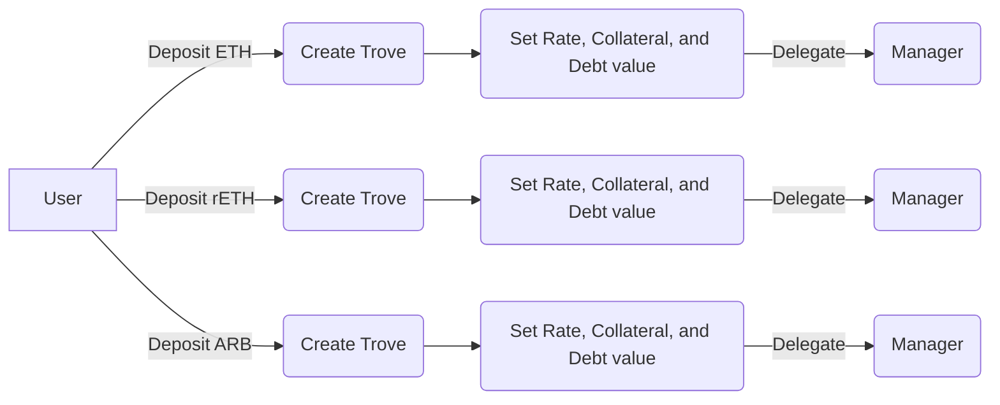

# Borrowing and Liquidations

### What makes borrowing on Firm so unique?

Firm allows users to borrow the stablecoin USND on their own terms. Borrowers can choose and adjust the rate they are willing to pay for their loans. Borrowers can choose to pay 0%, 5%, 20%, etc.. Borrowers will establish market rates in accordance with their individual risk tolerance without relying on governance or algorithm rate management. Each collateral also has its own respective borrow market which allows room for a market of rates to develop.

All of this makes for a highly capital efficient, secure and decentralized borrowing experience.

### What is a Trove?

When a borrower deposits collateral (ETH, wstETH, rETH, SNT, etc) a Trove is created.
A **Trove** is Firm's version of a 'vault'. Each Trove has a particular Ethereum address owner, and each owner can have multiple Troves.

Each Trove can only have 1 type of collateral deposited in it.

Each Trove allows you to manage a loan, adjusting collateral and debt values as needed, as well as setting your own interest rate. Trove management can optionally be delegated to a "Manager" who is given special permissions. 

Troves are also transferable NFTs, and can be found in the wallet of the owner. Be cautious with this: transferring the NFT also transfers the ownership of the position.

### What types of collateral can I use on Firm?

Firm works with the following collaterals: 
- ETH (Ether)
- wstETH (Wrapped Staked ETH)
- rETH (Rocket Pool ETH)
- SNT (Status Network Token)

:::tip
New collateral types can be added by governance. Existing ones can be removed, although users will always have the ability to withdraw their positions in the case of a collateral being removed. 
:::

### Is there a minimum debt?

Yes, a minimum debt of 200 USND is required for borrowing.

### **When do I need to pay back my loan?**

Loans issued by the protocol do not have a repayment schedule. You can leave your Trove open and repay your debt any time, as long as you maintain a healthy Loan-to-Value (LTV) Ratio.

### Is there a lockup period? 

There is no lockup period. Users are free to withdraw their collateral deposits whenever they want. 
As an exception, withdrawals by borrowers are temporarily suspended if the total LTV of a borrow market goes above 75%.

### How do I decide on my LTV?

This depends on your personal preferences, primarily your risk tolerance and how actively you want to manage your position(s). To help with the decision, you'll find preset options on the user interface that can serve as a guide.

:::tip
We may display BOLD instead of USND in several graphics which are borrowed from Liquity.
:::

Please note that these examples are for illustration purposes only and do not represent definitive risk or safety thresholds. It's essential to determine your own risk tolerance and comfort level as a user.

If your LTV becomes too high, your position will be liquidated.
> LTV = Loan to Value a LTV of 50% means that if you borrowed $100, your collateral is $200.

### How do Liquidations work in Firm?

Firm uses Tellor oracles to maintain proper price feeds for our collaterals. Check out the [oracles](/docs/technical-documentation/oracles) section for more info.

Troves get liquidated if the LTV goes above the maximum value.

Firm uses Stability Pools as its primary liquidation mechanism to absorb liquidated debt and collateral. Each borrow-market has its own dedicated Stability Pool earning liquidation gains (in the respective collateral) in exchange for burning debt. That means Stability Pool depositors earn 100% of the fees from liquidations on the protocol, and earn those fees in the liquidated collateral (for example, ETH).

Just-In-Time liquidations and a redistribution of debt and collateral across borrowers of the same market handle liquidations as a last resort if the Stability Pool were ever empty.

A liquidated borrower usually incurs a penalty of 5% and will be able to claim the remaining collateral after liquidation.

A special case is when a Redistribution is necessary, then:

* For ETH, wstETH, and rETH, the loss amounts to 10% of the debt (at most). That corresponds to a max. loss of 9.09% expressed in terms of collateral.
* For SNT the loss is higher due to increased volatility risk.

### How am I compensated for liquidating a Trove? 

The liquidation of Troves is connected with certain gas costs which the initiator has to cover. The protocol offers a gas compensation given by the following formula:

`0.0375 WETH + min(0.5% trove_collateral, 2_units_of_collateral)`

The `0.0375 WETH` equivalent is funded by a [refundable gas deposit](borrowing-and-liquidations.md#what-is-the-refundable-gas-deposit) while the variable `0.5%` part comes from the liquidated collateral, slightly reducing the liquidation gain for Stability Providers. The specific gas compensation varies by collateral type (e.g., 2 tBTC on the tBTC branch, 2 stATOM on the stATOM branch).

### What is the max Loan-To-Value (LTV)?

That depends on the collateral type you will use:

- ETH: 90.91% LTV (110% MCR)
- wstETH: 90.91% LTV (110% MCR)
- rETH: 90.91% LTV (110% MCR)
- SNT: 62.50% LTV (160% MCR)

### What is the refundable gas deposit?

To open a new Trove, the protocol requires a liquidation reserve of 0.0375 ETH regardless of the chosen collateral, which is set aside to cover the gas costs of a potential liquidation. The deposit is returned when the Trove is closed by the user (including upon redemptions).

### How much will I pay for my loan?

On Firm, there are no upfront fees. Instead, you pay interest on an ongoing basis, making it suitable for short-term loans as well. When creating a new position or increasing the amount borrowed, borrowers pay the first week of interest up front to prevent the protocol from leaking value to arbitrage bots.

The interest you pay is determined by the rate you set yourself. For example, if you borrow 10,000 USND at a 5% interest rate, you'll pay \~500 USND in interest after one year. This interest is added to your outstanding debt.

### What are user-set rates?

On Firm, users set their own interest rates, giving them full control over costs and improving predictability. This feature allows for adaptability to various market conditions and helps stabilize USND's peg.

User-set interest rates facilitate a capital-efficient equilibrium between USND borrowers and holders in a fully market-driven manner. Additionally, these rates serve as the primary revenue source for USND holders, generating a continuous, sustainable real yield for USND depositors and liquidity providers.

Borrowers should set their rates based on their [redemption](/docs/user-docs/redemption-and-delegation#what-are-redemptions) risk tolerance.

Read more about setting your rates, or letting a Rate Manager partner set them for you for free [here](https://www.liquity.org/blog/interest-rate-management-in-liquity-v2).

### Can I adjust the rate?

Yes, you can always adjust your interest rate at any time. Since you as a user get to set your own interest rate, you have full autonomy over your borrowing costs.

Note however, that a fee corresponding to 7 days of average interest is charged when opening the loan, as well as on any rate adjustments that happen less than 7 days after the last adjustment. Without it, low-interest rate borrowers could evade redemptions by sandwiching a redemption transaction with both an upward and downward interest rate adjustment, which in turn would unduly direct the redemption against higher-interest borrowers.

### How do I decide on the right rate for me?

Setting an interest rate determines a user's redemption risk and needs to be aligned with your goals and how actively you want to manage your position.

Users can also  decide to delegate interest rate management to a third party, who can set your interest rate and charge a fee for this service (see [link](/docs/user-docs/redemption-and-delegation#what-is-delegation-of-interest-rates)).

By opting to manage your own rate, you will have to weigh the savings from a lower rate against the higher redemption risk and the increased adjustment frequency with potential additional costs (premature adjustment fees and gas costs).

Since redemptions are performed in ascending order of interest rate (for the respective collateral asset), you will typically want to keep a buffer of other borrowers with lower rates in front of you. Choosing higher rates may increase the recurring costs of your loan, but give you peace of mind regarding unexpected market fluctuations.

You can see the distribution of other users' rates in a histogram and position yourself accordingly.

Redemptions usually occur when USND is trading below $1 minus the current redemption fee. Keeping an eye on the past [redemption activity](https://dune.com/liquity/liquity-v2#redemptions) can help you assess the overall redemption risk, serving as an additional data point for your rate selection.

In general, those willing to actively monitor their positions, or borrowing for shorter periods of time, may opt for lower rates. Conversely users optimizing for a more passive, long-term position would be better off with setting a higher relative interest rate.

### What could the average interest rate be?

These will be set, continuously, by the market and will vary over time. We would expect that, on average, rates should be similar to borrowing on Sky or Aave using ETH. However, due to the flexibility of user-set rates, it is possible that some users will pay significantly lower rates during certain periods.&#x20;

Given that 75% of the interest revenue is directly paid out to USND depositors , we further expect that stablecoin deposit yields should be comparable, if not higher than what competing CDP's and lending markets offer. Thanks to the attractiveness of USND and assuming the emergence of external use cases (monetary premium), this could lead to lower borrow rates overall than offered by other platforms. Learn more about the spread between borrowers and lenders in our [article](https://www.liquity.org/blog/liquity-v2-a-de-facto-reference-rate-for-defi).

### What determines the riskiness of my Trove?

There are two key parameters to consider:

* **Loan-to-value (LTV)**: This is based on your debt-to-collateral ratio and affects your risk of [liquidation](borrowing-and-liquidations.md#how-do-liquidations-work-in-firm).
* **Interest rate (IR)**: You set this rate yourself, and it influences your risk of being [redeemed](/docs/user-docs/redemption-and-delegation#what-are-redemptions).

You have the flexibility to set these parameters as you see fit, allowing you to control the relative riskiness of each Trove. You can create multiple Troves under the same address, enabling you to manage different risk profiles for different portions of your portfolio.

### Are there any other fees related to borrowing?

To impede Trove redemption evasion strategies where borrowers try to minimize their interest payments in an unfair manner, a small "premature adjustment fee" is charged on interest rate changes that happen within less than 7 days since the last adjustment (or the opening of the Trove). The premature adjustment fee is equal to 7 days of average interest on the respective borrow market. Note that this fee differs from the user's set interest rate.&#x20;

The fee is denominated in USND and added to the Trove's debt. The same fee is charged when a new Trove is opened or when its debt is increased (only affecting the added debt).

### How many Troves (loans) can I open with the same address?

You can have multiple open Troves for the same collateral or across different collateral types, all represented as separate NFTs.&#x20;

### Are Troves transferable?

Yes, they are represented as a NFT (ERC-721), hence easily transferable between wallets. When you send the NFT you also send full access to your Trove and all the funds within it.&#x20;

Please note that more advanced strategies like 'selling' Troves on secondary markets like OpenSea comes with inherent risks, and caution is advised.

### How do I loop my exposure?

Looping allows you to borrow FIRM against your deposited collateral (ETH, wstETH, rETH, or SNT) and use it to buy more collateral, increasing your exposure to the underlying asset. Firm has built-in automation to achieve this with one click (zappers).

Make sure you choose a frontend that supports this functionality, and be mindful of liquidity/slippage.

### How are collateral risks mitigated?

Firm has separate borrow markets for each collateral type with their own Stability Pools (for efficient liquidations), user-set interest rates, and LTV factors for their respective assets (ETH, wstETH, rETH, SNT).

Risks are mitigated through temporary borrowing restrictions in times of low collateralization of a given market, a redemption logic prioritizing  collateral with less Stability Pool backing, and a collateral shutdown as an emergency measure to maintain system balance and protect against market instability.

Keep in mind that despite all these measures, FIRM remains dependent on the supported collateral assets and there is no strict guarantee that it remains overcollateralized in case of a sudden collapse of a collateral asset.

### How does the system compartmentalize risk among different LSTs? 

This depends on the party in question:

* Borrowers: Collateral risk is limited to the collateral asset held by the borrower. A borrower isn't negatively affected by a failure of another collateral asset.
* FIRM Holders: As a multi-collateral stablecoin, FIRM is reliant on effective liquidations of undercollateralized loans in every borrow market to remain overcollateralized. Holders are subject to the risks of all supported collateral assets.
* Earners: Stability Pool depositors only get exposure to the asset they have opted for. However, as FIRM holders, they are similarly affected by potential depegging.

### What mechanisms are in place if the Stability Pool is empty?

If the Stability Pool doesn't cover the full entire debt and gets completely emptied by the liquidation, the system falls back to the following liquidations modes.

The liquidator can freely choose between two fallback liquidation modes for the debt exceeding the funds in the Stability Pool:

1. Just-in-time (JIT) liquidation: the liquidator sends an amount of FIRM corresponding to the (remaining) debt in exchange for 105% of its nominal value in the collateral asset.
2. Redistribution: the liquidator triggers a redistribution, through which the Trove's entire debt and collateral is redistributed to all fellow borrowers of the respective collateral market, in proportion to their own collateral amounts. Thus, the respective borrowers will receive a share of the liquidated collateral and see their debts increase proportionally.

### Shutdown Borrow Markets
The system may shut down borrow markets whose total collateralization ratio (TCR) falls below the minimum threshold for each collateral type (110% for ETH, wstETH, and rETH, 160% for SNT). The shutdown is performed by incentivizing redemptions against the respective collateral.
